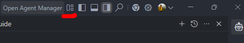

# 기획자를 위한 AI 코딩 협업 가이드 (VS Code & Git 완전 기초)

이 문서는 개발 지식이 전혀 없는 기획자분들이 AI(Claude, Codex, Gemini 등)의 도움을 받아 개발 프로젝트에 안전하고 쉽게 참여할 수 있도록 돕기 위한 가이드입니다.

## 1. AI 코딩 툴 준비하기

### 1-1. VS Code 설치하기

VS Code(Visual Studio Code)는 코드를 편집하고 확인하는 기본 프로그램(메모장 같은 역할)입니다.

1. [VS Code 공식 홈페이지](https://code.visualstudio.com/)에 접속하여 다운로드 후 설치합니다.

### 1-2. AI 코딩 툴 확장 프로그램 설치

VS Code 안에서 AI를 비서로 부리기 위해 '확장 프로그램(Extension)'을 설치해야 합니다. 팀에서 사용하는 도구(예: Claude, Codex, Gemini 등)를 설치합니다.

1. VS Code를 실행합니다.
2. 화면 왼쪽 가장자리의 메뉴 중 **네모 블록 4개가 모여있는 아이콘(Extensions)**을 클릭합니다.
3. 검색창에 `Claude`, `Codex`, 또는 `Gemini` 등 팀에서 사용할 AI 도구 이름을 검색합니다.
4. 파란색 [Install] 버튼을 눌러 설치를 완료합니다.

### 1-3. 보조 액티비티 바(Secondary Activity Bar)에 AI 아이콘 배치하기

화면을 넓게 쓰고, 코드 창과 AI 대화 창을 분리하기 위해 AI 도구 아이콘을 오른쪽으로 옮기는 것이 좋습니다. 이 우측 공간을 '보조 액티비티 바'라고 부릅니다.

1. **보조 액티비티 바 켜기:** 첨부된 이미지를 참고하여, VS Code 우측 상단의 레이아웃 제어 메뉴 중 **우측 네모가 칠해진 아이콘(빨간 줄 표시)**을 클릭해 보조 액티비티 바를 활성화합니다.

   
2. 방금 설치되어 왼쪽 메인 메뉴 목록에 나타난 **AI 도구 아이콘**을 마우스 왼쪽 버튼으로 **꾹 누릅니다 (드래그 준비)**.
3. 누른 상태로 마우스를 방금 활성화한 화면 오른쪽의 **보조 액티비티 바 영역**으로 끌어다 놓습니다(드롭).
4. 이제 화면 가운데(왼쪽)에서는 문서를 보고, 오른쪽 화면에서는 AI와 대화할 수 있는 완벽한 작업 환경이 분리됩니다!

---

## 2. 여러 명이 동시에 작업하면 생기는 문제 (충돌과 Git의 필요성)

개인이 혼자 코딩 툴을 쓰면 문제가 없지만, **우리 팀 전체가 같은 프로젝트 파일을 동시에 수정하다 보면 치명적인 문제**가 생깁니다.
어제 내가 공들여 수정한 내용을, 오늘 다른 팀원이 덮어써서 날려버리는 아찔한 상황('코드 충돌')이 발생하기 때문입니다.

이런 재앙을 막고 코드를 안전하게 관리하기 위해 전 세계 개발자들은 **'Git(깃)'** 이라는 규칙과 시스템을 사용합니다.
Git을 쓰면 원본을 안전하게 보호하면서도, 모두가 마음껏 코드를 고치고 하나로 완벽하게 합칠 수 있습니다.

### 🎯 [팁] 충돌을 예방하는 기획자의 AI 작문 요령

Git이 지켜주긴 하지만, 애초에 충돌이 덜 나게 작업하는 것이 베스트입니다. 아래 두 가지만 기억해 주세요.

1. **한 번에 하나씩 좁게 지시하기 (Atomic Task)**
   많은 일을 한꺼번에 시키면 AI도 헷갈리고 코드도 꼬이기 쉽습니다.

   - **나쁜 예:** "이 페이지 다듬어주고 버튼도 추가하고 디자인도 바꿔줘."
   - **좋은 예:** "메인 페이지의 '확인' 버튼을 더 세련되게 바꿔줘."
2. **'구역 나누어' 작업하기**
   "나는 '고객 리뷰' 팝업만 수정할게, 너는 '주문 내역' 창을 맡아줘"처럼, 서로 다루는 파일이나 위치가 겹치지 않게 나누어 작업하면 충돌을 99% 예방할 수 있습니다.

---

## 3. 실전! AI 코딩 협업 가이드 (팀원용)

우리 프로젝트는 코드가 꼬이는 것을 막기 위해 **'원본(main)에 직접 수정 금지'** 규칙을 사용하고 있습니다.
Git(깃)이라는 복잡한 시스템을 배우지 않아도, 화면 우측의 AI 채팅창에 **아래 순서대로 자연스럽게 말을 걸어주시면** AI가 알아서 모든 과정을 처리해 줍니다.

### 1단계: 내 전용 작업 공간 만들기 (Pull & Branch)

작업을 시작하기 전, 팀의 공용 클라우드(오리진)에서 최신 원본을 내려받고, 나만의 복사본 공간을 만들어 달라고 해야 합니다.

* 🗣️ **AI에게 할 말:** `"이제 새로 작업을 시작할 거야. 클라우드에서 최신 원본 코드(main)를 가져와서 'feature/내이름-오늘작업할내용' 이라는 새 브랜치를 만들어줘."`
* 💡 **비유:** 최신 마스터 문서 원본을 건드리지 않고, '내 이름이 적힌 사본 1장'을 복사해 오는 것과 같습니다.

### 2단계: AI와 함께 작업하기

나만의 작업 공간이 만들어졌다면, 이제 평소처럼 AI에게 원하는 수정을 요청하세요.

* 🗣️ **AI에게 할 말:** `"메인 페이지의 배경색을 연한 회색으로 바꿔줘."` 또는 `"로그인 버튼 복사해서 회원가입 버튼도 만들어줘."`

### 3단계: 작업물 중간 저장 및 클라우드 업로드 (Commit & Push)

작업이 어느 정도 마무리되었거나 퇴근하기 전에는, 내 컴퓨터를 넘어 공용 클라우드로 안전하게 백업해야 합니다.

* 🗣️ **AI에게 할 말:** `"지금까지 수정한 내용들 전부 '메인 페이지 배경색 수정'이라는 메모와 함께 중간 저장(Commit)하고, 오리진(origin) 서버에 업로드(Push)해 줘."`
* 💡 **비유:** 내 컴퓨터 지갑에만 둔 사진(작업물)을 다 같이 볼 수 있는 팀 인스타그램(클라우드)에 올리는 것과 같습니다.

### 4단계: 관리자에게 검토 및 결재 올리기 (Pull Request)

내 클라우드 공간에 저장이 끝났다면, 관리자에게 작업물을 진짜 원본에 합쳐도 될지 결재를 올려야 합니다.

* 🗣️ **AI에게 할 말:** `"방금 업로드한 내용으로 main 원본에 합쳐달라는 풀 리퀘스트(Pull Request, PR) 결재 서류를 만들어줘. 리뷰어는 관리자로 지정해줘."`
* **참고:** 결재 서류가 생성되면, 관리자가 내용을 확인하고 '승인(Approve)'을 해야 진짜 원본에 작업물이 최종적으로 합쳐집니다(Merge).

---

## 4. [관리자용] 빠른 결재 처리 가이드 (AI로 PR 처리하기)

팀원이 결재(PR)를 올렸을 때, 관리자는 웹 브라우저 접속 없이 VS Code 안에서 AI에게 부탁하여 편하게 검토하고 합칠 수 있습니다.

### 1단계: PR 목록 및 내용 요약받기

* 🗣️ **AI에게 할 말:** `"새로 올라온 풀 리퀘스트(PR) 목록을 확인하고, 가장 최근에 올라온 PR의 변경 사항을 요약해서 알려줘."`

### 2단계: 화면 보고 직접 테스트하기 (로컬 구동 확인)

* 🗣️ **AI에게 할 말 (확인 시작):** `"방금 그 PR 코드를 화면으로 확인하고 싶어. 현재 내 작업은 잠깐 저장해 두고, 그 PR 브랜치로 이동해서 개발 서버 화면(미리보기) 띄워줘."`

### 3단계: 피드백 주거나 승인(Merge)하기

테스트 결과에 따라 반려하거나 승인합니다.

* 🛑 **수정이 필요할 때 (반려 및 원상 복구):**
  🗣️ **AI에게 할 말:** `"화면을 보니 버튼 색상을 빨간색으로 바꿔야 해. 리뷰 상태를 'Request Changes(수정 요청)'로 처리하고 코멘트 남겨줘. 그리고 개발 서버 끄고 원래 내가 작업하던 브랜치로 돌아가 줘."`
* ✅ **통과시켜도 될 때 (승인, 머지 및 원상 복구):**
  🗣️ **AI에게 할 말:** `"화면 잘 나오네! 이 PR을 'Approve(승인)' 처리하고 즉시 main 브랜치로 머지(Merge)해 줘. 작업이 끝나면 해당 다 쓴 브랜치는 삭제하고, 서버 끈 다음 원래 내 작업 브랜치로 돌아가 줘."`
  * 💡 **안심 팁 (브랜치를 왜 삭제하나요?)**: 작업이 '진짜 원본'에 모두 복사되었으므로, 다 쓰고 내용까지 옮겨 적은 임시 이면지(작업 브랜치)를 버려 프로젝트 공간을 깔끔하게 유지하는 안전한 과정입니다.

---
