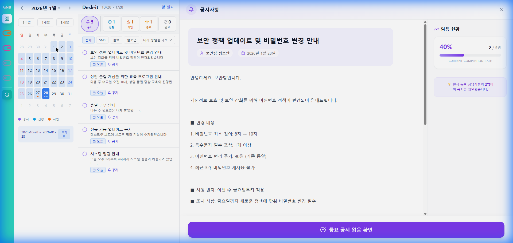
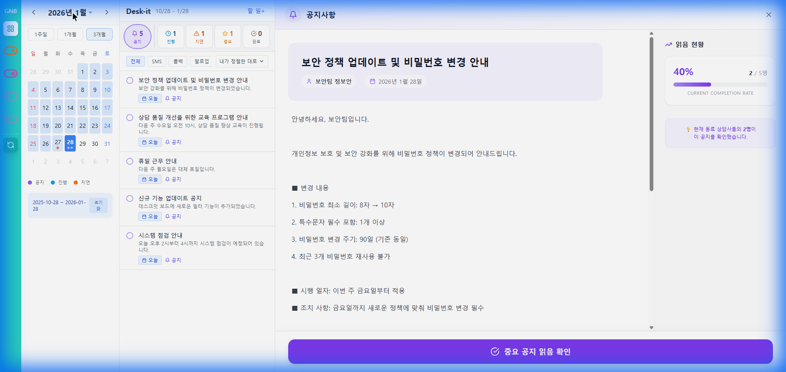
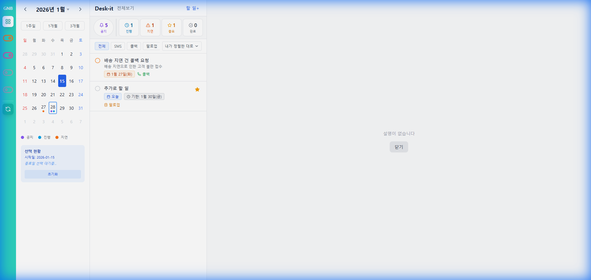
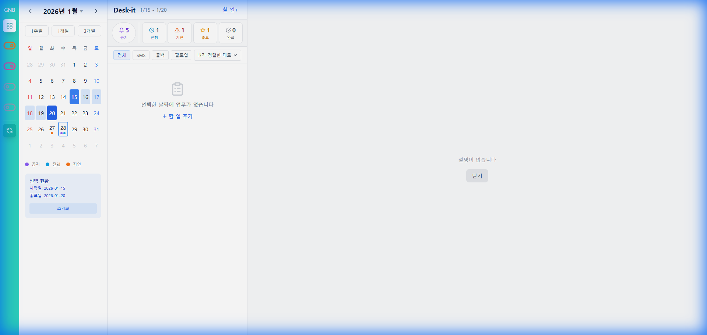

# Task 캘린더 개선 사항 워크스루

Task 캘린더에 빠른 기간 설정 프리셋, 월/년 선택기, 범위 선택 제한 및 UI 레이아웃 최적화 기능을 추가했습니다.

## 주요 변경 사항

### 1. 빠른 기간 설정 프리셋
캘린더 상단에 "1주일", "1개월", "3개월" 버튼을 추가했습니다. 클릭 한 번으로 오늘 기준의 기간을 즉시 설정할 수 있습니다.

### 2. 월/년 선택기 (Jump Navigation)
캘린더 헤더(예: "2026년 1월")를 클릭하면 월 그리드가 나타납니다. 여러 번 클릭할 필요 없이 원하는 달로 바로 이동할 수 있습니다.

### 3. 최대 선택 기간 제한 (3개월)
수동으로 날짜 범위를 선택할 때 최대 3개월(약 93일)을 초과할 수 없도록 제한 로직을 구현했습니다. 이를 통해 불필요하게 넓은 범위의 데이터 조회를 방지합니다.

### 4. 선택 UX 및 레이아웃 개선
- **호버 미리보기:** 시작일을 선택한 후 마우스를 올리면 선택될 범위를 연한 파란색 하이라이트로 미리 보여줍니다.
- **UI 겹침 수정:** 하단의 '선택 현황' 영역을 세로형(Stacked) 레이아웃으로 변경했습니다. 폭이 좁은 환경에서도 시작일, 종료일, 초기화 버튼이 겹치지 않고 깔끔하게 표시됩니다.
- **초기화 버튼:** 선택된 범위를 즉시 해제할 수 있는 버튼을 추가했습니다.

## 검증 결과

### 브라우저 자동 검증
브라우저 subagent를 통해 모든 신규 기능을 테스트했습니다:
- ✅ **프리셋:** 1주일, 1개월, 3개월 버튼이 정확한 날짜를 설정함.
- ✅ **월 선택기:** 헤더 클릭 시 월 그리드가 나타나고 선택한 달로 즉시 이동함.
- ✅ **기간 제한:** 3개월 초과 범위 선택 시 선택이 제한됨을 확인.
- ✅ **레이아웃:** 시작일 선택 시 하단 정보가 겹침 없이 세로로 깔끔하게 정렬됨.


*그림 1: 새로운 프리셋 버튼과 날짜 선택 미리보기 화면*


*그림 2: 빠른 이동을 위한 월/년 선택 대화상자*

### UI 겹침 수정 검증
````carousel

<!-- slide -->

````
*그림 3: 세로형 레이아웃 적용으로 가독성이 개선된 선택 현황 영역*
